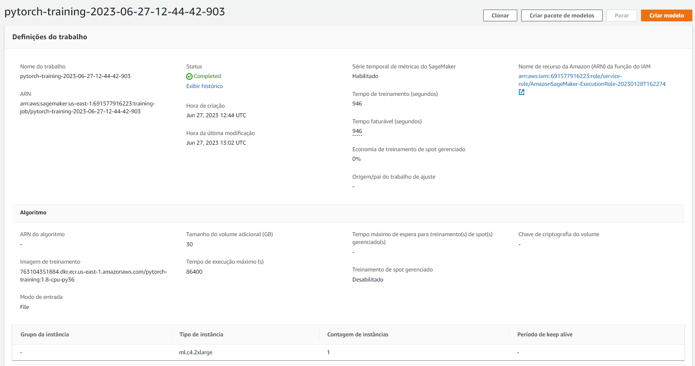
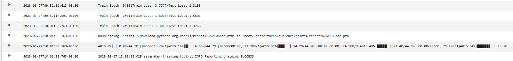
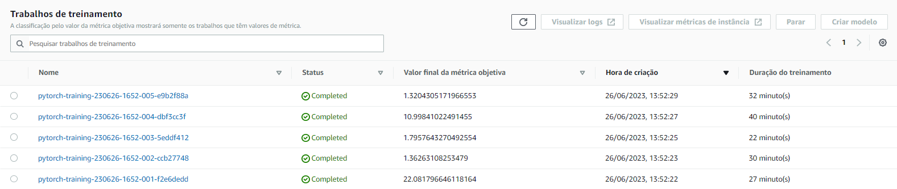
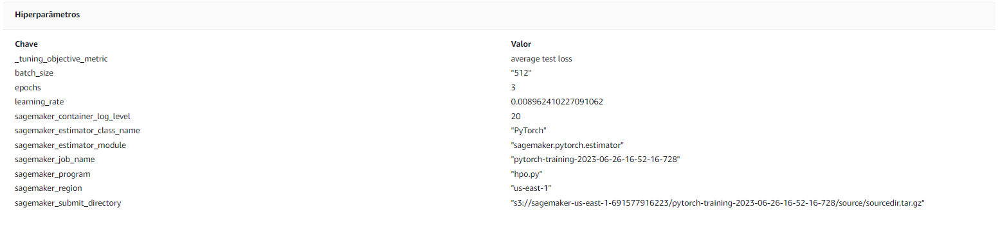

# Image Classification using AWS SageMaker

Use AWS Sagemaker to train a pretrained model that can perform image classification by using the Sagemaker profiling, debugger, hyperparameter tuning and other good ML engineering practices. This can be done on either the provided dog breed classication data set or one of your choice.

## Project Set Up and Installation
Enter AWS through the gateway in the course and open SageMaker Studio. 
Download the starter files.
Download/Make the dataset available. 

## Dataset
The provided dataset is the dogbreed classification dataset which can be found in the classroom.
The project is designed to be dataset independent so if there is a dataset that is more interesting or relevant to your work, you are welcome to use it to complete the project.

### Access
Upload the data to an S3 bucket through the AWS Gateway so that SageMaker has access to the data. 

## Hyperparameter Tuning
What kind of model did you choose for this experiment and why? Give an overview of the types of parameters and their ranges used for the hyperparameter search

The model is built with pretrained resnet34.
Hyperparameter Ranges:
    "learning_rate": ContinuousParameter(0.001, 0.1),
    "batch_size": CategoricalParameter([32, 64, 128, 256, 512]),
    "epochs": IntegerParameter(2, 4)
    
- Include a screenshot of completed training jobs

- Logs metrics during the training process

- Tune at least two hyperparameters

- Retrieve the best best hyperparameters from all your training jobs


## Debugging and Profiling
Based on this [link](https://github.com/aws/amazon-sagemaker-examples/blob/main/sagemaker-debugger/pytorch_model_debugging/pytorch_script_change_smdebug.ipynb) I plotted the CrossEntropyLoss in different steps of training and testing,

### Results
The model gets better performance each epoch interaction, but according to the profiling, I could didn't choose the best hardware for training, my GPU for example is underutilized, meaning I could increase the batch size and probably also increase performance, or I could have gotten a lower spec hardware to save up money.

Profiler availber at [ProfilerReport/profiler](ProfilerReport/profiler-output)


## Model Deployment
The model was deployed in a "ml.c4.xlarge" instance, and accepts JSON as input. The JSON should contain a image already transformed by torchvision.transforms method.
```python
import torchvision
import torchvision.transforms as transforms
from PIL import Image

img_path = "dogImages/test/056.Dachshund/Dachshund_04003.jpg"

image = Image.open(img_path)

testing_transform = transforms.Compose([
    transforms.RandomHorizontalFlip(p=0.5),
    transforms.Resize(224),
    transforms.ToTensor(),
    transforms.RandomResizedCrop(224),
    transforms.Normalize(mean=[0.485, 0.456, 0.406], std=[0.229, 0.224, 0.225])
])

img_tensor = testing_transform(image)
img_tensor = img_tensor.unsqueeze(0)
img_tensor_pred = np.array(img_tensor)

response = predictor.predict({"inputs": img_tensor_pred})
```
Active Endpoint
